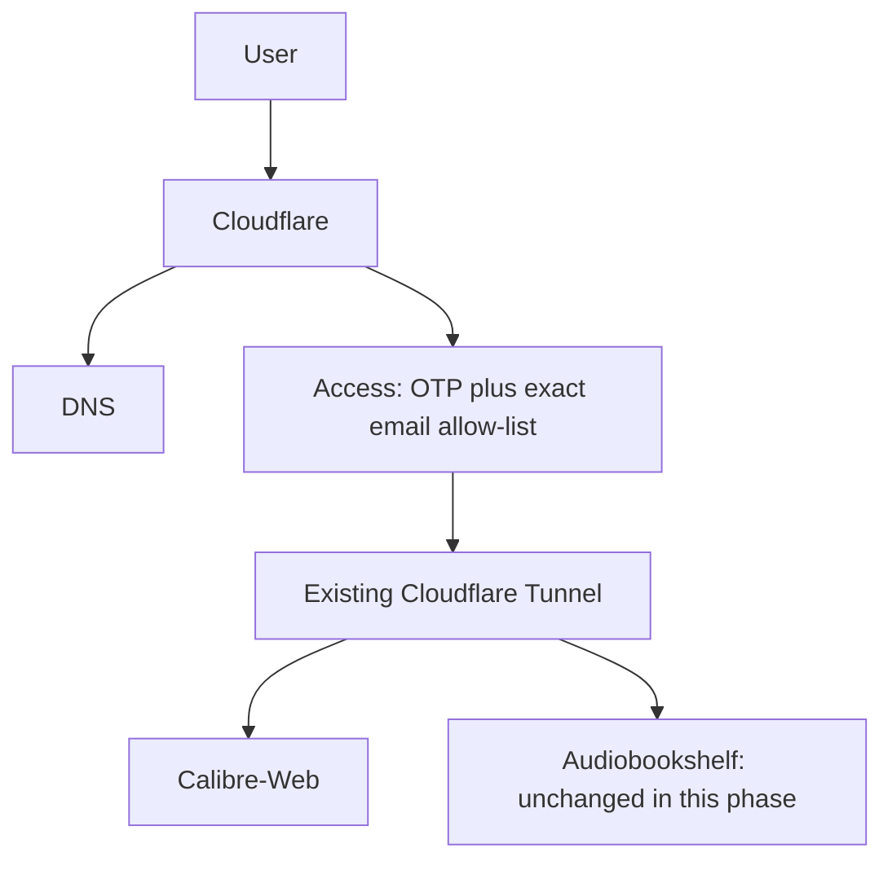

# Cloudflare-first Zero Trust migration

## Status and architecture

Cloudflare is the active ingress platform and is becoming the primary external
access boundary. Entra External ID is **pending decommission**, and Authentik is
temporarily retained for rollback. Calibre-Web is the first Access target;
Audiobookshelf is deliberately excluded pending native-client validation.



## Audit findings (2026-08-17)

The redacted inventory found one healthy, locally configured tunnel named
`homelab-m920-local`; proxied CNAMEs for `audiobooks`, `books`, and `auth`, all
pointing to that tunnel; no Access applications; and the built-in Cloudflare
identity provider. The tunnel and DNS records were already imported into HCP
workspace `homelab-m920`, and the recorded post-import plan was clean. No
resource is re-imported or recreated by this change.

## Live rollout result (2026-08-17)

The staged rollout completed successfully:

- Terraform created the One-Time PIN identity provider with a plan of
  `1 added, 0 changed, 0 destroyed`.
- The immediate post-apply plan returned no changes.
- Terraform then created only the `books.shelfgoblin.dev` self-hosted Access
  application and its exact-email OTP policy: `1 added, 0 changed, 0 destroyed`.
- The final live plan returned no changes.
- An anonymous request received a Cloudflare Access `302`, not origin content.
- The approved user completed OTP, then the deliberately retained Authentik
  login, and reached Calibre-Web successfully.

The current verified chain is therefore Cloudflare Access -> Authentik ->
Calibre-Web. Authentik removal remains a later, separately reviewed change.

A Zero Trust organization exists because the account returns its built-in IdP.
Re-run `scripts/inventory-cloudflare.ps1` to capture its redacted settings. It
remains unmanaged until those settings are reviewed. If management is later
required, add matching HCL, import it using the provider-documented account ID,
and require a zero-change plan before edits. Do not enable
`deny_unmatched_requests` in this phase.

## Terraform rollout

The root uses Cloudflare provider `5.23.0` and HCP workspace `homelab-m920` in
Local execution mode. Keep `enable_calibre_access=false` while reconciling the
existing tunnel and DNS. The first reviewed plan should add only the OTP IdP.
After that apply is verified, set these HCP variables and review a second plan:

```hcl
enable_calibre_access   = true
access_session_duration = "168h"
access_users             = ["approved-person@example.com"]
```

Store `access_users` as sensitive. Seven days balances a household media app's
usability with periodic reauthentication. Changing one set updates the sole
policy source. The policy includes exact addresses and separately requires the
OTP IdP. There is no Everyone, email-domain, bypass, or arbitrary-email rule.

OTP is Terraform-managed because the current Cloudflare-native IdP is not the
right way to provision friends/family. Cloudflare account membership does not
grant Calibre-Web access. Never apply from empty state. If a plan proposes a
tunnel/DNS deletion, replacement, or duplicate, stop and reconcile state/HCL.

## Calibre-Web manual validation

After a reviewed apply with `enable_calibre_access=true`:

1. In a private browser, open `https://books.shelfgoblin.dev`; confirm origin
   content is not visible before Cloudflare login.
2. Enter an approved address, receive the short-lived Cloudflare code, redeem
   it, and confirm Calibre-Web loads.
3. Log out of Access, repeat with an unapproved address, and confirm no usable
   code is delivered and the origin remains inaccessible. Cloudflare displays
   a generic sent message to prevent address enumeration.
4. Request the hostname with `curl` without cookies and confirm an Access
   redirect/denial rather than Calibre-Web HTML.
5. Confirm Calibre-Web's existing login still works after Access and LAN /
   Tailscale access is unchanged.
6. Inspect Access audit logs, then require a post-apply plan with zero changes.

Do not remove application or Authentik authentication until these tests pass
and the rollback observation period ends. `auth.shelfgoblin.dev` is untouched.

## Audiobookshelf recommendation

Keep `audiobooks.shelfgoblin.dev` on its current origin authentication path.
The deployed server is 2.36.0 and requires API and WebSocket traffic. The native
app has an open request for custom headers/service-token support, and its issue
history shows upstream browser authentication redirects can work in a browser
while failing in Android. Browser-based Access is not proven compatible.

Do not add a bypass. A future test on a non-production hostname must exercise
login, library sync, covers, streaming, downloads, progress, WebSockets, token
refresh, and reconnect on current Android/iOS clients. Service tokens are
machine credentials and are not a practical per-person mobile login until the
client can securely inject headers. Prefer Tailscale meanwhile; consider a
browser-only hostname only after an explicit routing and threat-model review.

## CI and protected variables

PRs always format, initialize without a backend, and validate. Plans run only
for same-repository PRs after `TF_ADOPTION_READY=true`. Apply is manual
`workflow_dispatch` only and uses the protected `infrastructure` environment.

GitHub environment secrets:

- `CLOUDFLARE_API_TOKEN`
- `TF_API_TOKEN`

GitHub/HCP variables:

- `TF_CLOUD_ORGANIZATION=homelab-sean`
- `TF_WORKSPACE=homelab-m920`
- `TF_ADOPTION_READY=true` only after imports and a safe local plan
- HCP inputs: account ID, zone ID/name, tunnel ID/name, `access_users`
  (sensitive), duration, and enable flag

Azure OIDC variables are no longer required by the Cloudflare workflow. Entra
remains separate and dormant; see `../terraform/entra/README.md`.

## Cloudflare API token permissions

Use scoped tokens, never a Global API Key. Inventory token:

- Account: Cloudflare Tunnel Read
- Account: Access Apps and Policies Read
- Account: Access Organizations, Identity Providers, and Groups Read
- Zone `shelfgoblin.dev`: Zone Read and DNS Read

Plan/apply token:

- Account: Cloudflare Tunnel Read (add Write only if provider operations prove
  it is required for this managed tunnel object)
- Account: Access Apps and Policies Write
- Account: Access Organizations, Identity Providers, and Groups Write
- Zone `shelfgoblin.dev`: DNS Write

Restrict tokens to the single account and zone. Values belong only in HCP /
GitHub protected secret storage and process environment variables.

## Validation

```powershell
terraform fmt -recursive
terraform init -backend=false
terraform validate
terraform plan -detailed-exitcode
git diff --check
git status --short
```

The normal plan must report zero destroys and replacements. A live plan requires
HCP and Cloudflare credentials and review before apply. Future destruction is
documented in `decommission-plan.md`.
